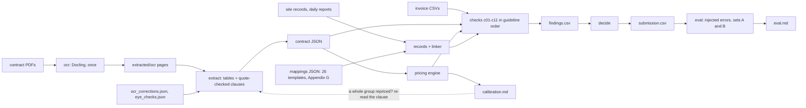

# Invoice Audit — Level 2
 
Audits 2,806 invoices against two amended contracts — 900 civil-works applications under
CW-2025-0417-CIV and 1,906 drilling invoices under DDS-2025-118 — and writes
`submission.csv`: for each invoice, whether it is wrong, the error category, the total the
contract supports, the billed total and a confidence.
 

 
## What it does
 
1. **OCR** (`ocr`): the scanned contracts are read once with Docling (RapidOCR); the page
   text is committed in `extracted/ocr/`, so later runs and the evaluator do not need the
   OCR models.
2. **Extraction** (`extract`): every rate, factor, date and percentage is written to
   `extracted/contracts/{civil,drilling}.json` with its page and clause. Values are verified
   against the invoices (calibration), by a manual check against the scanned page, or by a
   second OCR engine (`output/contract_verification.md`).
3. **Audit** (`audit`): records are parsed and linked to lines, every line is priced by the
   contract's build-up, and guideline checks 1-11 run in order (c01 ... c11). A line
   rejected by an earlier check is not re-priced by a later one. `decide` turns the findings
   into one verdict per invoice.
4. **Evaluation** (`eval`): errors are planted in clean invoices (set A for tuning, set B for
   the result) and the pipeline is scored on them.
The civil record wording is mapped to items with a fixed table
of 26 templates (`extracted/mappings/civil_phrases.json`): all 2,169 records match exactly one
template, so the phrase-mapping prompt (`prompts/v1_phrase_mapping.md`) was not needed and
was never run. Drilling report words are mapped through the contract's Appendix G and
Schedule 8 (`extracted/mappings/drilling_terms.json`).
 
## Setup
 
1. Install uv, if it is not installed:
```text
   # Linux / macOS
   curl -LsSf https://astral.sh/uv/install.sh | sh
 
   # Windows (PowerShell)
   powershell -ExecutionPolicy ByPass -c "irm https://astral.sh/uv/install.ps1 | iex"
 
   # or, on either system, with an existing Python
   pip install uv
```
 
   Open a new terminal afterwards so that `uv` is on the PATH.
2. The exercise data is included in `./data` (`civilwork/`, `drilling_services/` and
   `submission_template.csv`, from <https://github.com/majedzahrani3/invoice-auditing-level-2>).
   Another location can be set with `DATA_DIR` and `TEMPLATE_PATH` (see `.env.example`). The
   pipeline only reads this folder.
3. From the project folder, `uv sync --locked` installs the exact versions pinned in `uv.lock`
   (Python 3.11; uv downloads it if it is missing).
 
## Run
 
```text
uv run python -m audit all      # ocr (skips committed pages), extract, audit, eval; offline
uv run python -m audit audit    # checks only -> output/findings.csv, submission.csv
uv run python -m audit eval     # injected errors -> output/eval.md
uv run pytest                   # 125 tests
```
 
## Outputs
 
| file | content |
| --- | --- |
| `submission.csv` | the deliverable: 2,806 rows in template order, money in minor units |
| `output/findings.csv` | every finding: check, category, money effect, clause, evidence, confidence, status |
| `output/calibration.md` | share of lines whose billed rate the pricing engine reproduces, per item and rate period |
| `output/eval.md` | set B result (and set A, the tuning record) |
| `output/contract_verification.md` | how each extracted value was verified |
| `docs/REPORT.md`, `docs/DECISION_LOG.md` | results, error analysis, and every reading chosen |
 
## AI disclosure
 
AI assistance was used for data exploration, planning and implementation, under the author's
direction and review. The prompts are in `prompts/` as versioned files: `v0.md` holds the
standing instructions, and the phase prompts follow it. Every rule in the pipeline comes from a
cited clause, and the mapping files are fixed files built from the contract and checked on all
records.